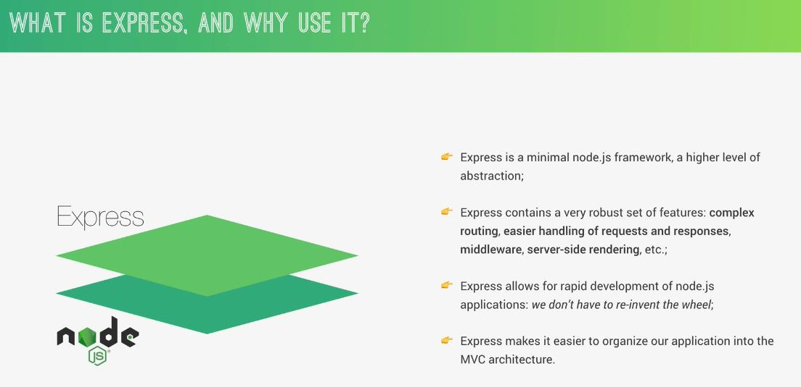
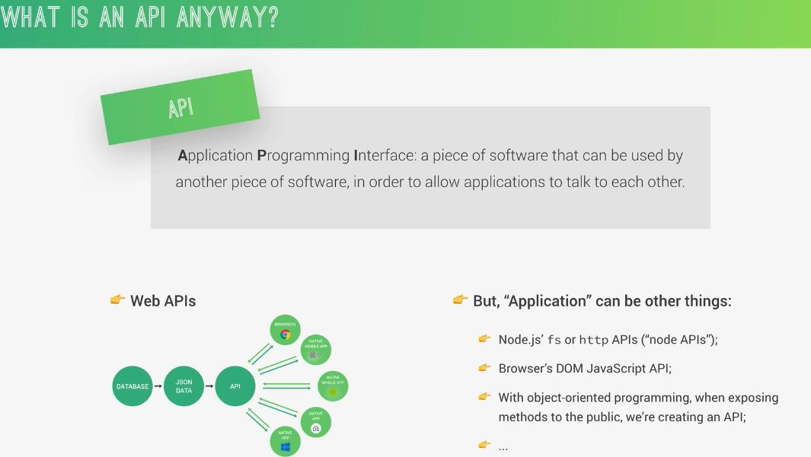
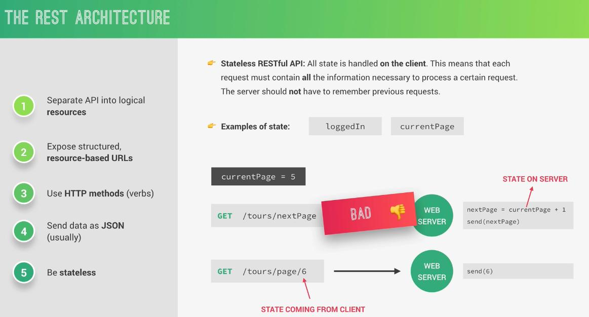

# NODE.js

- Node.js is a JavaScript Runtime built on google's open-source V8 Javascript engine. 🤔

## Why and when to use Node.js?


## http status






---

## avoid repeating the try/catch code

```node
const asyncHandler = (fn) => (req, res, next) =>
  Promise.resolve(fn(req, res, next)).catch(next);
```

---

- Node Project:

1. Quiz app
2. Forum (Like Reddit)
3. Restaurant Management
4. Social NetWork
